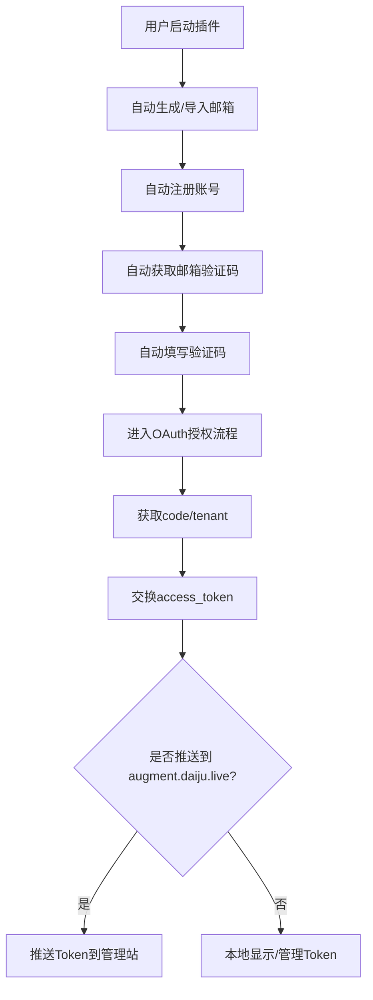

# AugmentCode 自动注册 + OAuth 令牌获取油猴插件

## 简介

本项目是一个 Tampermonkey/Greasemonkey 用户脚本，自动完成 AugmentCode 平台账号注册流程，并自动获取 OAuth Token。适用于批量注册、自动化测试、开发调试等场景。

## 功能特性
- 自动生成或批量导入邮箱，自动注册账号
- 自动收取邮箱验证码并填写
- 自动完成 OAuth PKCE 流程，获取 access_token
- 支持批量注册、Token 管理、日志查看
- 可视化 UI 面板，支持自定义参数和实时监控
- 支持临时邮箱服务、预设邮箱、注册间隔、最大注册数等高级配置

## 安装方法
1. 安装 [Tampermonkey](https://www.tampermonkey.net/) 或 [Greasemonkey](https://www.greasespot.net/)
2. 新建脚本，将 `AugmentCode-Complete-AutoRegister-OAuth.user.js` 全部内容复制粘贴进去并保存
3. 访问支持的 AugmentCode 相关页面（如 https://*.augmentcode.com/ 等），右下角会出现插件面板

## 使用说明
1. 打开 AugmentCode 相关页面，点击右下角插件面板
2. 配置注册数量、邮箱类型（临时/预设）、注册间隔等参数
3. 点击“开始注册”按钮，插件将自动完成注册、验证码收取、Token 获取等全流程
4. 注册完成后，可在面板查看账号信息、Token、日志等

### 高级用法
- 支持批量导入邮箱（粘贴邮箱列表）
- 支持自定义最大注册数、注册间隔、验证码等待时间等
- 支持日志导出、Token 测试、状态重置等

## 常见问题
- **Q: 为什么没有出现插件面板？**
  - 请确认已安装脚本且当前页面域名符合脚本 @match 规则
- **Q: 注册失败/Token 获取失败？**
  - 检查网络环境，或查看日志面板获取详细错误信息
- **Q: 如何切换邮箱类型？**
  - 在面板中选择“临时邮箱”或“预设邮箱”

## 插件界面截图


## 配置说明

> **重要提示：请根据实际需求修改邮箱配置！**

- 主邮箱域名常量：
  ```js
  const EMAIL_DOMAIN = "@test.com"; // 需替换为你的真实邮箱域名
  ```
- 临时邮箱服务配置：
  ```js
  const TEMP_MAIL_CONFIG = {
    username: "test",    // 临时邮箱用户名
    emailExtension: "@mailto.plus", // 临时邮箱扩展域名
    epin: "000"     // 临时邮箱PIN码
  };
  ```
- 临时邮箱原理：脚本通过 Cloudflare 代理 tempmail 服务，自动获取验证码并完成注册流程。

## 工作原理与流程图

### 原理说明
1. 用户在 AugmentCode 页面启动插件
2. 插件根据配置自动生成/导入邮箱，填写注册表单并提交
3. 自动访问临时邮箱（或预设邮箱），轮询并提取验证码
4. 自动填写验证码，完成注册
5. 进入 OAuth 授权流程，自动生成 PKCE 参数，获取 code/tenant
6. 自动交换 access_token，完成 Token 获取
7. （可选）将注册信息/Token 自动推送到 [augment.daiju.live](https://augment.daiju.live) 进行集中管理

### 数据流流程图（Mermaid 格式）


## augment.daiju.live 推送说明
- 插件支持自动将注册获得的账号、Token 信息推送到 [augment.daiju.live](https://augment.daiju.live)
- 该站点由第三方开发，可用于集中管理和备份 Token
- 推送功能可在插件面板中配置开关

## 免责声明
本脚本仅供学习、测试与自动化开发使用，禁止用于非法用途。

---

如需详细原理、二次开发或遇到问题，建议阅读源码或联系作者。
